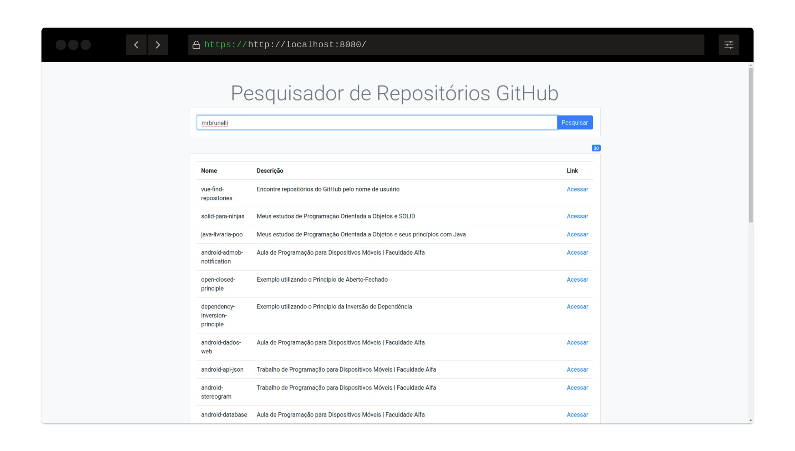

## :mag: Find Repositories with Vue.js
> Encontre repositórios do GitHub pelo nome de usuário

:point_right: [Disponível online aqui](https://mrbrunelli.github.io/vue-find-repositories/) :point_left:
### É muito fácil
> Digite o nome do usuário na barra de pesquisa e clique em pesquisar

### Layout responsível
> Bootstrap UI

